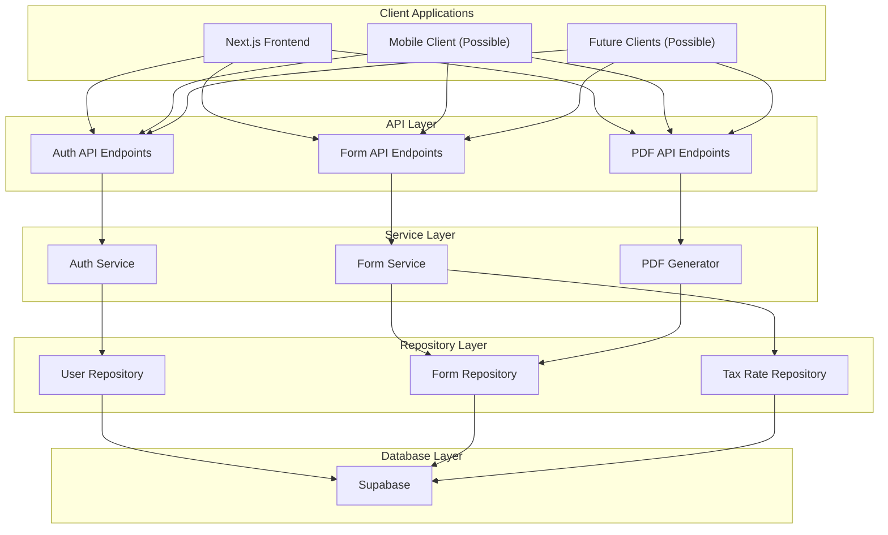

# NC Cigar Sales Form Filler - Technical Architecture

## API-First Architecture

This project follows an API-first approach where the backend API is developed first as a stable foundation, with the UI consuming these APIs. This architecture ensures a clean separation of concerns and enables multiple potential client interfaces in the future.

## Technology Stack Overview

### Backend API
- **Primary Technology**: Next.js API Routes with Express/NestJS-like patterns
- **API Design**: RESTful API endpoints with OpenAPI/Swagger documentation
- **Testing**: Jest for unit and integration testing
- **PDF Processing**: pdf-lib v1.17.1 for server-side PDF generation
- **Dependency Injection**: Factory pattern with repository interfaces

### Database & Authentication
- **Primary DB**: Supabase v2.19.7 with PostgreSQL
- **ORM**: TypeORM or Prisma for database access
- **Authentication**: 
  - Supabase Auth with JWT tokens
  - Role-based access control
  - Enhanced security with refresh tokens

### Frontend (API Consumer)
- **Framework**: Next.js 15.2.3 with App Router
- **API Integration**: React Query for API state management
- **UI Components**: 
  - ag-grid-react for professional data table displays
  - Shadcn/UI (latest) for modern component collection
  - Radix UI v1.1.2 for accessible primitives
- **Form Handling**: 
  - React Hook Form v7.51.1 for validation and state management
  - Zod v3.22.4 for schema validation

## System Architecture



## Dependency Injection Implementation

We implement a maintainable dependency injection pattern using the factory pattern with repository interfaces. This approach provides the benefits of dependency injection without the complexity of a full DI container.

### Repository Pattern Implementation

```typescript
// 1. Define interfaces
// repositories/interfaces/userRepository.ts
export interface IUserRepository {
  getById(id: string): Promise<User | null>;
  create(user: UserCreateDto): Promise<User>;
  // other methods
}

// 2. Create implementations
// repositories/supabase/userRepository.ts
export class SupabaseUserRepository implements IUserRepository {
  constructor(private supabaseClient: SupabaseClient) {}
  
  async getById(id: string): Promise<User | null> {
    const { data, error } = await this.supabaseClient
      .from('users')
      .select()
      .eq('id', id)
      .single();
      
    if (error) throw error;
    return data;
  }
  
  // Other method implementations
}

// 3. Create service that uses the repository
// services/userService.ts
export class UserService {
  constructor(private userRepository: IUserRepository) {}
  
  async getUser(id: string): Promise<User | null> {
    return this.userRepository.getById(id);
  }
  
  // Other service methods
}

// 4. Factory to create services with dependencies injected
// factories/serviceFactory.ts
import { supabaseClient } from '../lib/supabase';
import { SupabaseUserRepository } from '../repositories/supabase/userRepository';
import { UserService } from '../services/userService';

export function createUserService(): UserService {
  const userRepository = new SupabaseUserRepository(supabaseClient);
  return new UserService(userRepository);
}

// 5. Usage in API route
// pages/api/users/[id].ts
import { createUserService } from '../../../factories/serviceFactory';

export default async function handler(req, res) {
  const userService = createUserService();
  
  const { id } = req.query;
  const user = await userService.getUser(id);
  
  if (!user) {
    return res.status(404).json({ message: 'User not found' });
  }
  
  return res.status(200).json(user);
}
```

This pattern allows us to:
- Easily switch database implementations by creating new repository classes
- Mock repositories for testing without touching the database
- Maintain clean separation of concerns
- Keep API endpoints focused on request handling rather than implementation details

## Key Architecture Decisions

1. **API-First Approach**
   - Focus on developing a stable API before UI implementation
   - Clean separation between frontend and backend
   - Enables multiple client interfaces in the future
   - Comprehensive API documentation with OpenAPI/Swagger

2. **Layered Architecture**
   - API Layer: Handles HTTP requests/responses, validation, and authorization
   - Service Layer: Implements business logic and coordinates operations
   - Repository Layer: Abstracts data access with interface-based design
   - Database Layer: Manages data persistence with Supabase

3. **Role-Based Security**
   - JWT-based authentication with refresh token rotation
   - Role-based access control at the API level
   - Row-level security policies at the database level
   - Comprehensive permission system

4. **Server-Side PDF Generation**
   - PDF generation handled exclusively on the server for security
   - Support for digital signatures and official form formats
   - Secure storage and retrieval of generated documents
   - Preview capabilities with configurable resolution

5. **Tax Rate Management**
   - Historical tracking of tax rates and multipliers
   - Automatic application of appropriate rates based on dates
   - Admin-only management of rates with effective dates
   - Secure calculation of taxes on the server side

## Deployment Strategy

The application is deployed in phases:

1. **Phase 1**: API Foundation
   - Core API endpoints with authentication
   - Database schema and migrations
   - PDF generation capability
   - Basic security implementation

2. **Phase 2**: UI Integration
   - Frontend implementation consuming APIs
   - Form entry components
   - User dashboard
   - PDF preview and download

3. **Phase 3**: Enhanced Features
   - Payment processing
   - Advanced reporting
   - SSO integration
   - Enhanced user management

4. **Phase 4**: Scaling & Integration
   - Third-party API integrations
   - Subscription model
   - Performance optimizations
   - Advanced analytics

See the subdirectories for detailed specifications on data models, API endpoints, and implementation details.
