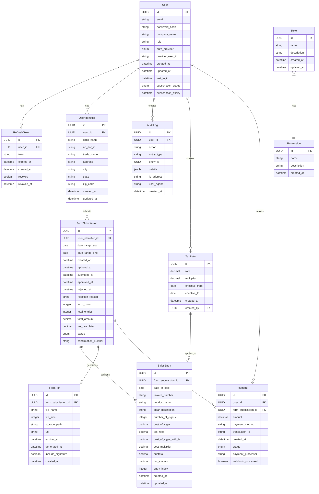

# Database Schema Specification

This schema provides the foundation for the API-first NC Cigar Sales Form Filler application, supporting role-based authentication, comprehensive form management, and server-side tax calculations.

> **Note**: A complete SQL migration script is available at `/technical/data-models/001_initial_migration.sql`. This script includes additional database triggers, indices, and transaction management not shown in this documentation.

## Core Data Models

### User
- `id` (UUID): Primary key
- `email` (string): User's email address
- `password_hash` (string): Hashed password (not stored directly)
- `company_name` (string): User's company or business name
- `role` (string): User role (admin, vendor, readonly)
- `auth_provider` (enum): Authentication provider (email, google, apple, github)
- `provider_user_id` (string, nullable): ID from third-party auth provider
- `created_at` (datetime): Account creation timestamp
- `updated_at` (datetime): Last update timestamp
- `last_login` (datetime): Last login timestamp
- `subscription_status` (enum): Current subscription status
- `subscription_expiry` (datetime, nullable): Subscription expiration date

### Role
- `id` (UUID): Primary key
- `name` (string): Role name
- `description` (string): Role description
- `created_at` (datetime): Creation timestamp
- `updated_at` (datetime): Last update timestamp

### Permission
- `id` (UUID): Primary key
- `name` (string): Permission name
- `description` (string): Permission description
- `created_at` (datetime): Creation timestamp

### RolePermission
- `role_id` (UUID): Foreign key to Role
- `permission_id` (UUID): Foreign key to Permission
- `created_at` (datetime): Creation timestamp

### RefreshToken
- `id` (UUID): Primary key
- `user_id` (UUID): Foreign key to User
- `token` (string): Hashed refresh token
- `expires_at` (datetime): Expiration timestamp
- `created_at` (datetime): Creation timestamp
- `revoked` (boolean): Whether token has been revoked
- `revoked_at` (datetime, nullable): When token was revoked

### UserIdentifier
- `id` (UUID): Primary key
- `user_id` (UUID): Foreign key to User
- `legal_name` (string, max 35 chars): Business legal name
- `nc_dor_id` (string, max 11 chars): NC Department of Revenue ID
- `trade_name` (string, nullable): Business trade name
- `address` (string, nullable): Business address
- `city` (string, nullable): Business city
- `state` (string, nullable): Business state
- `zip_code` (string, nullable): Business ZIP code
- `created_at` (datetime): Creation timestamp
- `updated_at` (datetime): Last update timestamp

### FormSubmission
- `id` (UUID): Primary key
- `user_identifier_id` (UUID): Foreign key to UserIdentifier
- `date_range_start` (date): Start of reporting period
- `date_range_end` (date): End of reporting period
- `created_at` (datetime): Form creation timestamp
- `updated_at` (datetime): Last update timestamp
- `submitted_at` (datetime, nullable): When the form was submitted
- `approved_at` (datetime, nullable): When the form was approved
- `rejected_at` (datetime, nullable): When the form was rejected
- `rejection_reason` (string, nullable): Reason for rejection
- `form_count` (integer): Number of form pages generated
- `total_entries` (integer): Total number of sales entries
- `total_amount` (decimal): Total tax amount
- `tax_calculated` (decimal): Total tax calculated for all entries
- `status` (enum): Form status (draft, in_progress, submitted, approved, rejected)
- `confirmation_number` (string, nullable): Confirmation number after submission

### SalesEntry
- `id` (UUID): Primary key
- `form_submission_id` (UUID): Foreign key to FormSubmission
- `date_of_sale` (date): When the sale occurred
- `invoice_number` (string): Reference invoice number
- `vendor_name` (string): Name of vendor
- `cigar_description` (string): Description of cigar product
- `number_of_cigars` (integer): Quantity sold
- `cost_of_cigar` (decimal): Base cost in USD
- `tax_rate` (decimal): Current NC tax rate (stored explicitly for historical accuracy)
- `cost_of_cigar_with_tax` (decimal): Calculated as `cost_of_cigar * tax_rate`
- `cost_multiplier` (decimal): Current NC multiplier (stored explicitly for historical accuracy)
- `subtotal` (decimal): Calculated as `GREATEST((number_of_cigars * cost_multiplier) - (cost_of_cigar * tax_rate), 0)`
- `tax_amount` (decimal): The calculated tax amount
- `entry_index` (integer): For ordering and pagination
- `created_at` (datetime): Creation timestamp
- `updated_at` (datetime): Last update timestamp

### TaxRate
- `id` (UUID): Primary key
- `rate` (decimal): Tax rate value
- `multiplier` (decimal): Tax multiplier value
- `effective_from` (date): When the rate began
- `effective_to` (date, nullable): When the rate ended (null if current)
- `created_at` (datetime): Creation timestamp
- `created_by` (UUID): Foreign key to User who created this rate

### Payment
- `id` (UUID): Primary key
- `user_id` (UUID): Foreign key to User
- `form_submission_id` (UUID): Foreign key to FormSubmission
- `amount` (decimal): Payment amount
- `payment_method` (string): Method used (credit card, etc.)
- `transaction_id` (string): Reference from payment processor
- `created_at` (datetime): Payment timestamp
- `status` (enum): Payment status (pending, completed, failed)
- `payment_processor` (string): Service used to process payment (Stripe, Square, etc.)
- `webhook_processed` (boolean): Whether a webhook was received and processed

### FormPdf
- `id` (UUID): Primary key
- `form_submission_id` (UUID): Foreign key to FormSubmission
- `file_name` (string): Name of the PDF file
- `file_size` (integer): Size of the PDF in bytes
- `storage_path` (string): Path to the PDF in storage
- `url` (string, nullable): Public URL to access the PDF
- `expires_at` (datetime, nullable): When the URL expires
- `generated_at` (datetime): When the PDF was generated
- `include_signature` (boolean): Whether a signature was included
- `created_at` (datetime): Creation timestamp

### AuditLog
- `id` (UUID): Primary key
- `user_id` (UUID, nullable): Foreign key to User
- `action` (string): Action performed (create, update, delete, etc.)
- `entity_type` (string): Type of entity affected (Form, SalesEntry, etc.)
- `entity_id` (UUID): ID of the entity affected
- `details` (jsonb): Additional details about the action
- `ip_address` (string): IP address of the user
- `user_agent` (string): User agent of the client
- `created_at` (datetime): When the action occurred

## Entity Relationships



## Type Definitions

The database schema translates to the following TypeScript interfaces:

```typescript
export interface User {
  id: string;
  email: string;
  company_name?: string;
  role: 'admin' | 'vendor' | 'readonly';
  auth_provider: 'email' | 'google' | 'apple' | 'github';
  provider_user_id?: string;
  created_at: string;
  updated_at: string;
  last_login?: string;
  subscription_status: 'free' | 'premium' | 'enterprise';
  subscription_expiry?: string;
}

export interface UserIdentifier {
  id: string;
  user_id: string;
  legal_name: string;
  nc_dor_id: string;
  trade_name?: string;
  address?: string;
  city?: string;
  state?: string;
  zip_code?: string;
  created_at: string;
  updated_at: string;
}

export interface FormSubmission {
  id: string;
  user_identifier_id: string;
  date_range_start: string;
  date_range_end: string;
  created_at: string;
  updated_at: string;
  submitted_at?: string;
  approved_at?: string;
  rejected_at?: string;
  rejection_reason?: string;
  form_count: number;
  total_entries: number;
  total_amount: number;
  tax_calculated: number;
  status: 'draft' | 'in_progress' | 'submitted' | 'approved' | 'rejected';
  confirmation_number?: string;
}

export interface SalesEntry {
  id: string;
  form_submission_id: string;
  date_of_sale: string;
  invoice_number?: string;
  vendor_name: string;
  cigar_description: string;
  number_of_cigars: number;
  cost_of_cigar: number;
  tax_rate: number;
  cost_of_cigar_with_tax: number;
  cost_multiplier: number;
  subtotal: number;
  tax_amount: number;
  entry_index: number;
  created_at: string;
  updated_at: string;
}

export interface TaxRate {
  id: string;
  rate: number;
  multiplier: number;
  effective_from: string;
  effective_to?: string;
  created_at: string;
  created_by?: string;
}

export interface Payment {
  id: string;
  user_id?: string;
  form_submission_id?: string;
  amount: number;
  payment_method: string;
  transaction_id?: string;
  created_at: string;
  status: 'pending' | 'completed' | 'failed';
  payment_processor: string;
  webhook_processed: boolean;
}

export interface FormPdf {
  id: string;
  form_submission_id: string;
  file_name: string;
  file_size: number;
  storage_path: string;
  url?: string;
  expires_at?: string;
  generated_at: string;
  include_signature: boolean;
  created_at: string;
}
```

## Database Migrations

The project should use a migration management tool (such as Prisma Migrate) to handle database schema changes. This will ensure that all changes are properly versioned and can be applied consistently across development, staging, and production environments.

Each major feature addition or API enhancement should include corresponding database migration scripts that can be automatically applied when the application is deployed.
